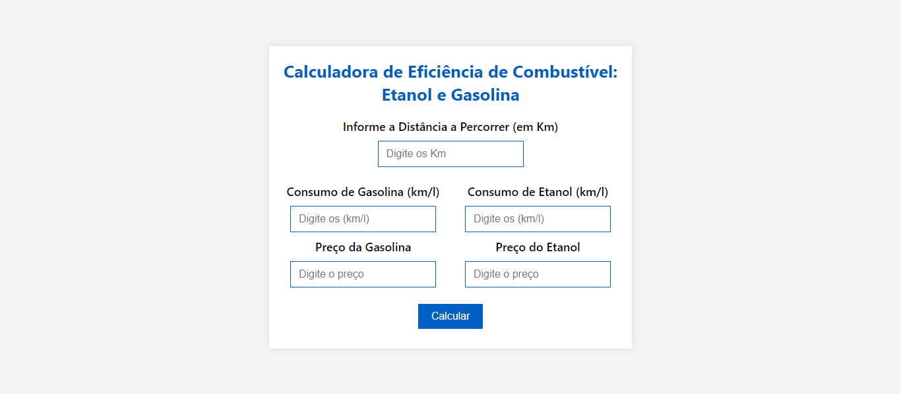

<h1 align="center">
  Calculadora de Eficiência de Combustível: Etanol e Gasolina
</h1>

  

## Projeto - Calculadora de Eficiência de Combustível: Etanol e Gasolina

Este projeto oferece aos usuários uma calculadora de eficiência de combustível, ajudando a escolher entre gasolina e etanol com base nos preços, consumo e distância a percorrer. Com um design atraente e responsivo, é funcional em vários dispositivos.

Tecnologias Utilizadas:
* [HTML (Linguagem de marcação):](https://www.w3schools.com/html/html_intro.asp) Utilizado para estruturar e definir o conteúdo da página, incluindo cabeçalhos, parágrafos, listas e imagens.
* [CSS (Folha de estilos em cascata):](https://www.w3schools.com/css/css_intro.asp) Utilizado para estilizar os elementos da página, definindo cores, tamanhos, fontes e layout, proporcionando uma aparência visualmente atraente.
* [JavaScript:](https://developer.mozilla.org/pt-BR/docs/Web/JavaScript) Utilizado para adicionar interatividade à página, permitindo que o usuário selecione personagens e exiba informações dinamicamente.
* [React:](https://react.dev/) Utilizado para construir interfaces de usuário interativas e dinâmicas em aplicações web.
* [TinyJPG](https://tinyjpg.com/) e [TinyPNG:](https://tinypng.com/) O site utilizado é uma ferramenta online que comprime imagens JPEG e PNG sem perder muita qualidade. Ele reduz o tamanho dos arquivos de imagem usando algoritmos eficientes de compressão.

Créditos:
* Criado por minha autoria | [José Carlos • jcddsj01](https://github.com/jcddsj01)

Implantação do Projeto no Vercel: [Explore o projeto clicando aqui.]()

---

## Project - Fuel Efficiency Calculator: Ethanol and Gasoline

This project offers users a fuel efficiency calculator, helping them to choose between gasoline and ethanol based on prices, consumption and distance traveled. With an attractive and responsive design, it is functional on multiple devices.

Technologies used: 
* [HTML (Linguagem de marcação):](https://www.w3schools.com/html/html_intro.asp) Used to structure and define the content of the page, including headings, paragraphs, lists and images.
* [CSS (Folha de estilos em cascata):](https://www.w3schools.com/css/css_intro.asp) Used to style the elements of the page, defining colors, sizes, fonts and layout, providing a visually appealing appearance.
* [JavaScript:](https://developer.mozilla.org/pt-BR/docs/Web/JavaScript) Used to add interactivity to the page, allowing the user to select characters and display information dynamically.
* [React:](https://react.dev/) Used to build interactive and dynamic user interfaces in web applications.
* [TinyJPG](https://tinyjpg.com/) and [TinyPNG:](https://tinypng.com/) The website used is an online tool that compresses JPEG and PNG images without losing too much quality. It reduces 

Credits:
* Created by me | [José Carlos • jcddsj01](https://github.com/jcddsj01)

Project deployment on Vercel: [Explore the project by clicking here.]()
